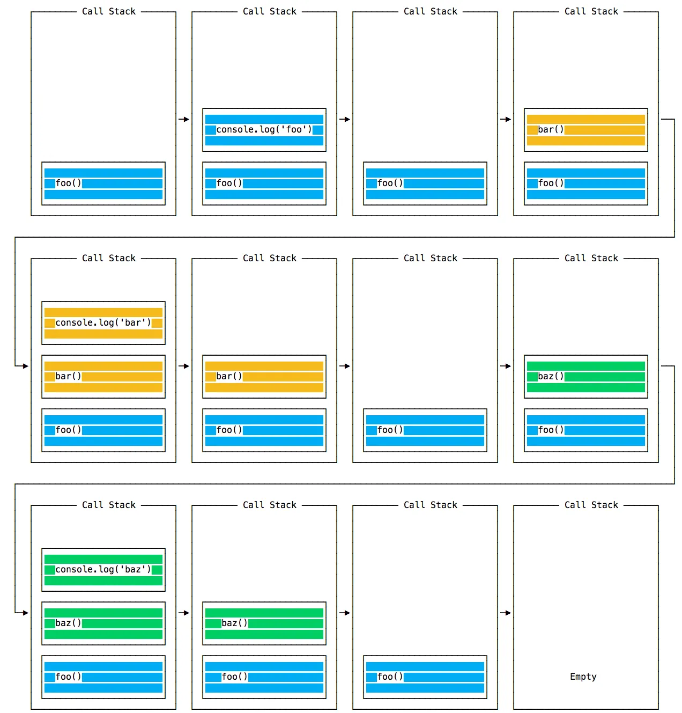
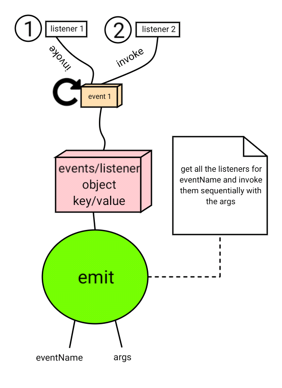
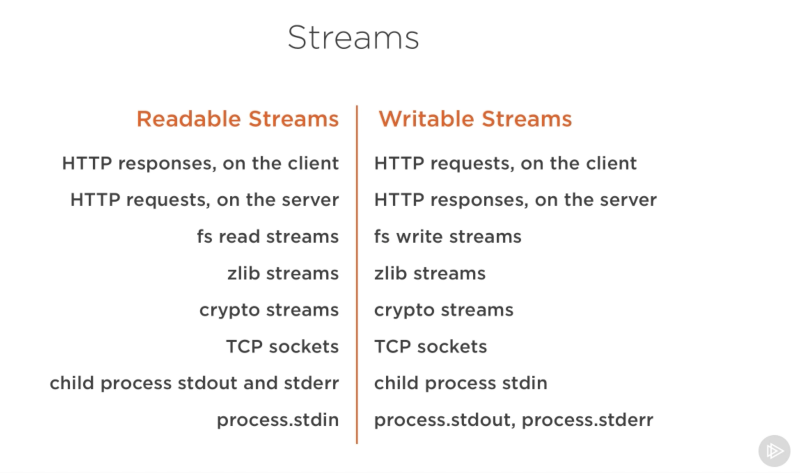

<h1>The Node.js Architecture </h1>


There are several dependencies that Node.js relies on to work the way it does.

- Libraries: 
    - V8: Node.js is a JavaScript run time based on Google's V8 engine.
    - libuv: libuv is an open source library that focuses on asynchronous IO (input & output). This layer is what gives Node access to the underlying computer operating system; file system, networking, etc. Besides, libuv also implements two crucial features on Node, which are **event loop** and **thread pool**.
    - llhttp
    - c-areas
    - OpenSSL
    - zlib

- Tools: 
    - npm
    - gyp
    - gtes


Processes, Threads and the Thread Pool
-----------------------------------------


To simply put, there is a Node process when a computer runs a Node app. In that process, Node.js runs in a **single thread**. 

- A **thread** is just a sequence of instructions.

So the fact that Node runs in a single thread, it's easy to block applications. However, this is a unique feature that Node brings on the table. It doesn't matter if you have 10 or 10 millions of users, they access your application at the same time. So it's important to not blocking that thread.

A simple single thread workflow:

1. Initialize program
2. Execute *top-level* program
3. Require modules
4. Register event callbacks
5. **START EVENT LOOP**

Some tasks require heavy CPU usage, that's where the **thread pool** comes in — gives additional four threads (or more) that are run separately from main thread. So the event loop automatically offloads the heavy tasks to the thread pool.

Those expensive tasks are: 

- File system APIs
- Anything related to cryptography
- Compression
- DNS lookups

<h2>Event Loop</h2>

Simply event loop is where all the application code that inside the callback functions are executed. All code that is not top level code will run in the event loop (some parts might be offloaded to the thread pool).

**NOTE: The ***event loop*** is the heart of the Node architecture.**

Node.js is built around callback functions and uses **event-driven architecture**, so:

    - Events are emitted
    - Event loops picks them up
    - Callbacks are called

When the Node app is invoked, the event loop starts running right away. The event loop has multiple phases, and each phase has it's own **call-back queue**.

<h2>Call Stack</h2>

```
const bar = () => console.log('bar')

const baz = () => console.log('baz')

const foo = () => {
  console.log('foo')
  bar()
  baz()
}

foo()
```




<h3>Simple Review</h3>

Event loop is what makes asynchronous programming possible in Node.js, making it the most important feature in Node's design and making Node.js completely different from other platforms. It takes care of all incoming events and performs orchestration by offloading heavier tasks into the thread pool, and doing the most simple work itself.

We need the event loop because in Node.js everything works in one single thread, and so, you can have thousands or millions of users accessing the same thread at the same time.

**NOTE: It's developer's responsibility to not block the event loop.**

<h3>Don't Block!</h3>

1. Don't use **sync** versions of functions in *fs*, *crypto* and *zlib* modules in your callback functions.<br><br>
2. Don't perform complex calculations (*e.g.* loops inside loops). <br><br>
3. Be careful with JSON in large objects.<br><br>
4. Don't use too complex regular expressions (*e.g.* nested quantifiers).<br><br>

<h2>Events and Event-Driven Architecture</h2>

Most of the Node's core modules, like `https`, `fs` and timers such as `setImmediate()`, etc. 

In Node, there are certain objects called event emitters that emit named events as soon as something important happens in the app, like a request hitting server, or a timer expiring, or a file finishing to read.

These events can then be picked up by event listeners that will fire off callback functions attached to each event listener.



An example: 

``` 
const EventEmitter = require("node:events");
const myEmitter = new EventEmitter();

myEmitter.on("newSale", () => {
    console.log("There is a new sale!");
});

myEmitter.on("newSale", () => {
    console.log("We're gonna earn money!");
});


myEmitter.on("newSale", stock => {
    console.log(`There are now ${stock} items left in stock.`);
});

myEmitter.on("customerName", () => {
    console.log("Customer name: Looney");
});

myEmitter.emit("newSale", 9);
myEmitter.emit("customerName", "Looney");
```

**NOTE:** if is there `.on()` method, then there's a code listening an event.

For `newSale` in the code snippet runs above, if there's multiple listeners for the same event, they will run **synchronously** (one after the other).

But in real environment it's better to use classes: 

```
import EventEmitter = require("node:events");

class Sales extends EventEmitter {
    constructor() {
        super();
    }
};
```

<h2>Streams</h2>

In simple words; streams use process (read and write) data piece by piece (as chunks), without completing the whole read or write operation, and therefore without keeping all the data in memory.

When we read a file using streams, we read part of the data, do something with it, then free the memory, and repeat this until the entire file has been processed.

*e.g.* Netflix or Youtube, instead of downloading the whole video, we can watch the start of the content (the video is download piece by piece — or in chunks, before the entire video is downloaded). 

1. It's useful for handling large volumes of data like videos. Recieving data piece by piece from an external source.

2. It's memory efficient — there's no need to keep all the data in memory.

3. It's also time efficient — since the process starts in smaller chunks, so the procedure starts earlier rather than the general way.

- There are four types of streams:
    - Readable Streams
    - Writable Streams
    - Duplex Streams
    - Transform Streams

However, the readable and writable streams are the most used & important ones.



**NOTE:** Streams are actually instances of the `EventEmitter` class which means they can emit and listen to named events.

<table>
    <tdata>
    <tr>
        <td>Readable Streams</td>
        <td>Writable Streams</td>
        <td>Duplex Streams</td>
        <td>Transform Streams</td>
    </tr>
    </tdata>
</table>

> ### Readable Streams
>
> #### Description
>> Streams from which we can read — consume data
> #### Example
>> - http requests
>> - fs read streams 
> #### Important Events
>> - data
>> - end
> #### Important Functions
>> - `.pipe()`
>> - `.read()`

<br>

> ### Writable Streams
> 
> #### Description
>> Streams to which we can write data
> #### Example
>> - http responses
>> - fs write streams
> #### Important Events
>> - drain
>> - finish
> #### Important functions
>> - `.write()`
>> - `.end()`

<br>

> ### Duplex Streams
> 
> #### Description
> 
>> Streams that are both readable and writable — it's like a singly linked list, you can both write and read data together.
>
> <h4>Example</h4>
> 
>> - net web socket — a communication channel between the client and the server that works in both directions.

<br>

> ### Transform Streams
>
> #### Description
>> A transform stream is basically a duplex stream that can be used to modify or transform the data as it is written and read.
>
> #### Example
> 
>> - `zlib` Gzip creation

<br>

**NOTE:** Instead of just using the *consume streams*, we can create our own streams too.


<h2>Streams Example</h2>

Suppose for some reason in our app we need to read a large text file from the file system, then send it to the client.


### 1. Easiest, Yet the Worst

```
const fs = require("node:fs");
const http = require("node:http");

const server = http.createServer();

server.on("request", (req, res) => {
    // Solution 1 — the simplest yet the worst
    fs.readFile("test-file.txt", (err, data) => {
        if (err) console.log(err);
        res.end(data);
    });

});

const port = 5050;
server.listen(port, () => {
    console.log("Listening on port " + port + "...");
});

```

### 2. A Better Approach

```
const fs = require("node:fs");
const http = require("node:http");

const server = http.createServer();

server.on("request", (req, res) => {
    const readable = fs.createReadStream("path/to/file.txt");

    readible.on("data", chunk => {
        res.write(chunk);
    });

    readible.on("end", () => {
        res.end();
    });

    readible.on("error", err => {
        console.log(err);
        res.statusCode = 500;
        res.end("File not found");
    });
});

const port = 5050;
server.listen(port, () => {
    console.log("Listening on port " + port + "...");
});
```

It's working as fine, however this one would create a problem called *backpressure*. The problem is that our readable stream — the one we're using to read the file from the disk — is much faster than sending the result which we response to the writable stream. So this will overwhelm the network. Response stream wouldn't handle all the incoming data so fast. This is *backpressure*. 

<h3>3. An Even Better Approach</h3>

This is where the `.pipe()` operator comes in. This is available on all readable streams and it allows us to pipe the output of a readable stream right into the input of a writable stream. So, this will fix the *backpressure*, because it will automatically handle the both speed of data coming & out.

It's basically `readableSource.pipe(writableDestination)`. The `writableDestination` might be *duplex* or *transform stream* as well, but what matters is we can write to the stream.

```
const fs = require("node:fs");
const http = require("node:http");

const server = http.createServer();

server.on("request", (req, res) => {
    const readable = fs.createReadStream("path/to/file.txt")
    readable.pipe(res); // that's all! — destination is the response
});

const port = 5050;
server.listen(port, () => {
    console.log("Listening on port " + port + "...");
});
```

In a situation like this, the pipe operator is the best solution.